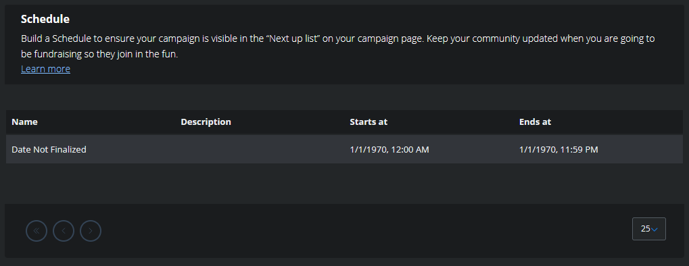

# Event Schedule

The [Campaign schedule](https://info.tiltify.com/a/solutions/articles/43000008835?portalId=43000014313) allows viewers to
be aware of what events are occuring during the charity stream!

## Adding an Event to the Schedule

Each schedule item has the following options:

- Name of the event
- Description of what the event will consist of
- Start date/time an event is occurring
- End date/time an event is ending on

We'll be working with community streamers to figure out what events will be occurring and when. Some of these events will
be group events with everyone - while others may be specific to a streamer or a subset of Frame Drop streamers.

To suggest an event to be added to the campaign, send a message to [the #streamers channel in Discord](https://discord.theframedrops.com) with your idea.

## Community Note

You're able to view the schedule before the campaign is publicly announced.

This event list will added to, removed from, and generally updated up until the date of public event announcement/campaign publish.

While we have some ideas of events ourselves, we strongly encourage both streamers (and community members alike) to suggest
ideas for events we can do (either as a group, subgroup, or individually). We want our schedule to work for as many streamers as possible!

## Appearance

The closest event (set to occur that day) in the schedule will be shown on the donation page in the information sidebar.

If viewed on any other day, it will state "No upcoming schedule". However, when it's within the current day of activities,
the sidebar will instead display the next upcoming event that day.

Of course, this will update as the day goes on and the event is passed - it will show the event coming up soon after.

In order to view the full schedule from the donation page, users can select "view full schedule" next to "Next up on the schedule"

