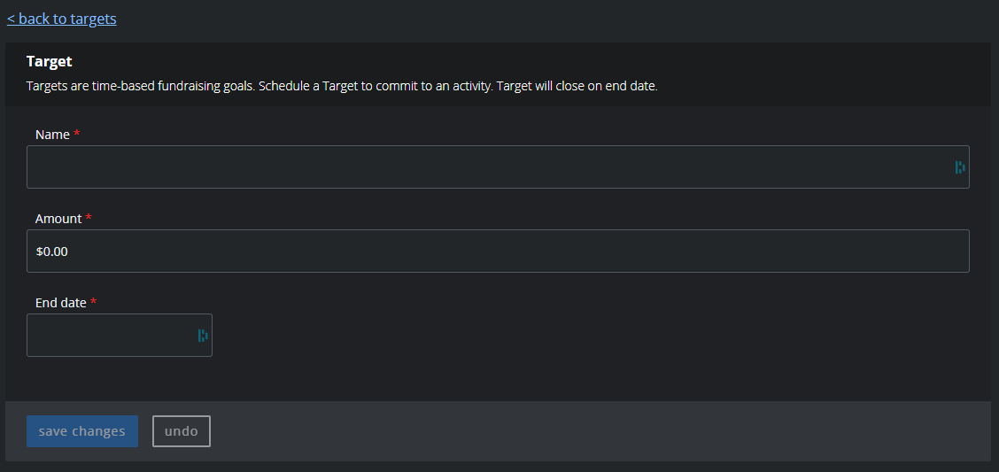

# Event Targets

[Campaign Targets](https://info.tiltify.com/support/solutions/articles/43000011862-adding-incentives-targets-formerly-known-as-challenges-)
are similar to community channel point pools on Twitch. You're able to use them as a way to introduce a type of reward that the whole
community can work towards (instead of a single individual).

Like Twitch community rewards, these have a timer associated with them and can be time restricted to a specific point of time (or date) to end.

> For a way to do something similar to the individual channel point rewards Twitch provides using charity donations,
> see our page on [rewards](/streamers-setup/tiltify/rewards/).

## Adding a Target

Each target has the following options:

- Name of the reward
- Amount the reward will cost before triggering
- Ending date/time to stop listening for goals

To ask for a target to be added to the campaign, send a message to [the #streamers channel in Discord](https://discord.theframedrops.com) with the above information.

### Community Note

Since we will have multiple streamers, we will need to distinguish the different targets to distinguish "community wide" targets and
"streamer wide" targets. To do this, we will likely have (global) or (streamer {{channel name}}) appended (or prepended) to the name of the reward

## Appearance

Each target is listed in the donation page and can be selected by the user.

