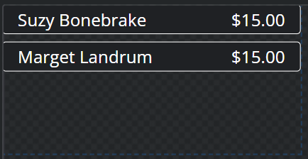
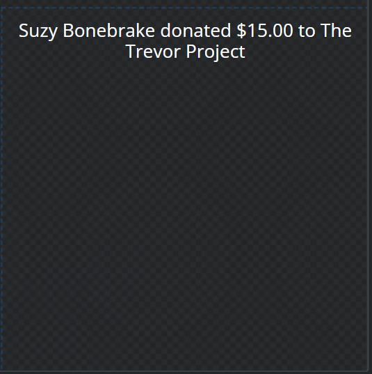

# Events Components

> Overlay URL:  https://overlays.tiltify.com/ScKcHFK0JoDOb-azVY4WVHJO8ZZXjqWd

## Components Preview

**Donation List**:

**Donation Popup**:

## Included Components

| Name | Description | Crop Left | Crop Right | Crop Top | Crop Bottom |
| --- | --- | --- | --- | --- | --- |
| Donation List | Lists the last four (4) donations, including donor name and amount | 0 | 1510 | 0 | 820 |
| Donation Popup | Shows incoming donations for 3 seconds. Shows donor name, amount, and charity | 1420 | 0 | 880 | 0 |

The popup intentionally has space left at the bottom. This is in case someone's name is long enough
to cause the text to wrap.

> [Learn how to use this chart with our docs page](/overlays/separate-merged-components/)

## Implementation Notes

We have the ability to add notification noises when someone donates. We currently have this disabled, but if
the community wants we can enable it easily (with a range of noises to choose from). If we decide to enable this,
those that wish to disable the functionality can do so easily within OBS.

We also have the ability to set a minimum donation in order to have their names displayed in either the popup
or donation list. This is currently set to $5 to avoid potential donation-trolls that will submit money to add negative/fake
names.

### Popup

For the popup, we could add a sticker or GIF [from Giphy](https://giphy.com/) to play alongside each donation popup. We currently do not have
this enabled, as we felt streamers may have different aesthetics and selecting any one image to play may cause detrimental to that.

We're also unable to change the donation text that reads "{{name}} donated to {{charity}}".
