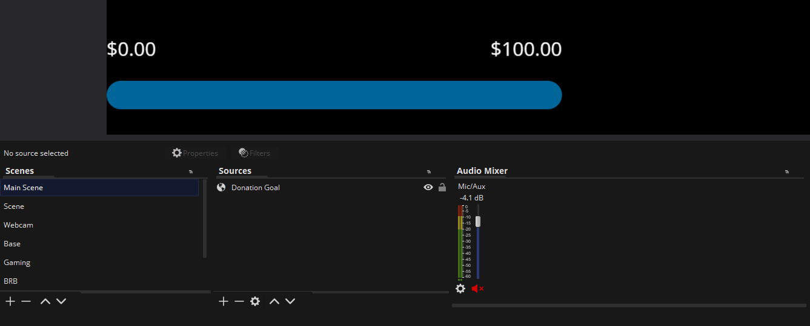
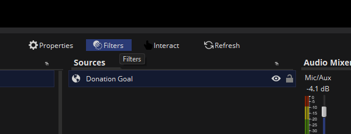

# Overlay Colors

Most of our overlays are simply utilizing black and white, and therefore don't need
significant modification to fit within a channel's branding. However, there _are_ provided overlays that utilize a blue background for some UI elements. 

Because our livestream event contains various streamers, each with their own brand colors, we've
simply left the default [blue color of `#006699`](https://g.co/kgs/s1ZLUf).

However, if your brand colors are not blue, there are ways you can still utilize the provided overlays in your OBS setup.

To do this, simply use a "Color Correction" "Filter" to Hue Shift the colors to align closer to your intended colors. Because
all other colors in the provided overlays are black and white, only the default blue color will be shifted.

## Step-by-Step

Once you've added the selected overlay Browser source to your Scene, you should see it listed in your "Sources" tab.

Select the browser source (in this case "Donation Goal") and click on the "Filters" button above.

Once selected, you'll see a dialog of filters currently applied to the source. This should be empty for now.

Click on the "+" button in the bottom left corner of the dialog and select "Color Correction" as your filter to add

Finally, once the settings dialog box for "Color Correction" is opened, change the slider (or numerical inputs) of "Hue Shift". It should
update the preview with the color that will be set once closing the settings page

