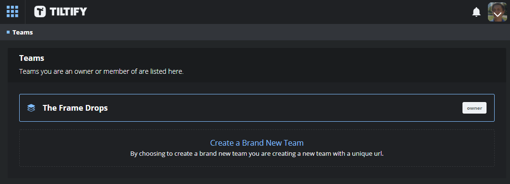
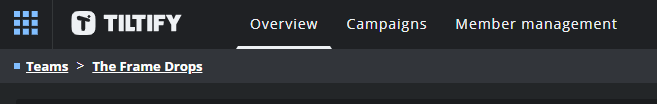
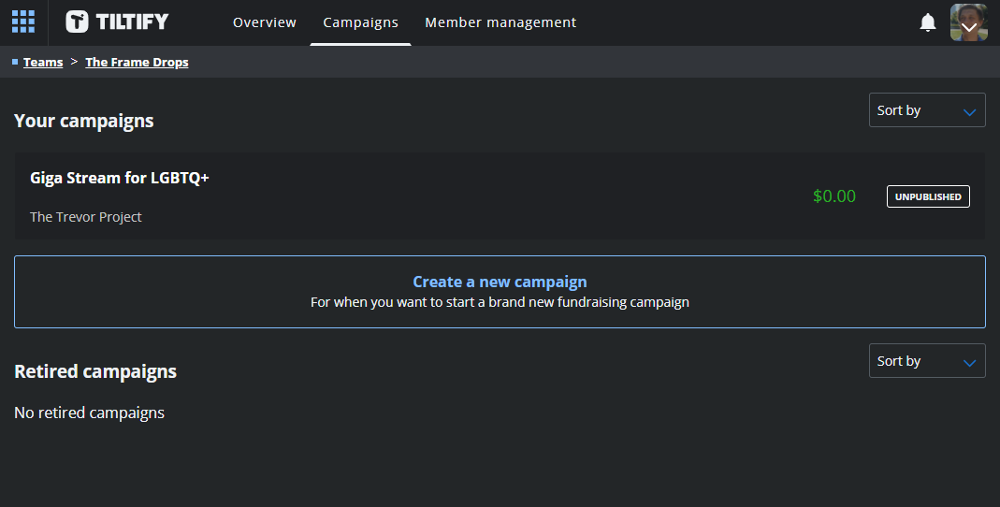

# Tiltify

[Tiltify](https://tiltify.com/) is a fundraising tool that allows you to have teams of people
collaborate with one another in order to raise money for a charity of your choosing.

For our livestream, we've chosen to support [The Trevor Project](https://www.thetrevorproject.org/).

You can see our team Tiltify page here: https://tiltify.com/+the-frame-drops/profile

To join our Tiltify team, you'll need an invite code. To access this code, please [Join our Discord](https://discord.gg/yQrnFcKF7p)
and mention that you'd like to be a streamer. We'll add you to a special channel where we'll provide the invite code and can help you

## Features

Titlify provides us multiple features to inform donors and enable more community engagement to our charity event.

These include:

- [Easy-to-setup OBS Overlays to show donation goals, events, and more](/streamers-setup/overlays/)
- [Schedule of upcoming events during the campaign](/streamers-setup/tiltify/schedule/)
- [Milestones to indicate progress to donors](/streamers-setup/tiltify/milestones/)
- [Polls powered by donations](/streamers-setup/tiltify/polls/)
- [Rewards enabled by an individual's donations, like channel points](/streamers-setup/tiltify/rewards/)
- [Targets enabled by the community's donations, like community pooled channel points](/streamers-setup/tiltify/rewards/)

## Setup

Once you receive your invite code, you'll need to sign into a Tiltify account. If you do not currently have one, you can
easily create one using your Twitch account to login (no password needed).

> During your account creation process, it will ask you for your first and last name. Don't worry, though, your name is not published
on your Tiltify profile and instead uses a username system.
> 
> To see an example of what a profile might look like, [you can view an example of one of the mods](https://tiltify.com/@crutchcorn/profile)

Once you've gotten the invite code and logged into a Tiltify account, you should be greeted with the following screen:

### Campaign

While joining the team on Tiltify allows you access to join the team as a streamer, the actual event in question is
called a "Campaign" in Tiltify.

Let's explore how to navigate the Tiltify dashboard and see information about the campaign ahead-of-publication.

### Main Dashboard

To open your dashboard, select your profile picture in the top right corner of any of Tiltify's pages. This will provide a dropdown of
options related to your account. From these options, select "dashboard"

Once your dashboard is open, you should see four options:

1) Campaigns
2) Teams
3) My account
4) Public profile

While it may seem intuitive to select "Campaigns" to see the upcoming group stream information,
**the campaigns option in dashboard will not show the group stream information**. That tab is only used for
personal campaigns.

To see the team campaign, start by selecting "Teams". This will bring up a list of Tiltify teams you're a member in.

Select "The Frame Drops" from the list.

### Team Dashboard

When you access the team dashboard page, you'll be defaulted to seeing the "Overview" tab.

If you check in the top navigation bar, you'll see three tabs related to this team:

1) Overview
2) Campaigns
3) Member management

While the "Overview" tab provides useful information about the team itself, you're unable to modify the team unless you're a mod.
Likewise, you're unable to any of the information in "Member management" unless you're a mod.

Select the "Campaigns" option.

From here, you'll see a list of all of the campaigns, both published and unpublished.

