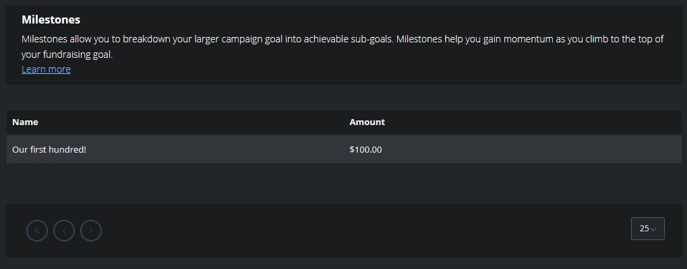

# Campaign Milestones

A [fundraising milestone](https://info.tiltify.com/support/solutions/articles/43000008808-adding-milestones) can be added to mark a subgoal of the total campaign progress. These can be used to mark significant amounts of progress on the fundraiser.

## Adding a Milestone

Each milestone has the following options:
- a short name that will appear in the milestone list
- an amount that should be reached for it to be satisfied.

To ask for a milestone to be added to the campaign, send a message to [the `#streamers` channel in Discord](https://discord.gg/yQrnFcKF7p) with the above information.

## Appearance

The closest milestone will be shown on the donation page in the information sidebar.

Listed next to the "Next Milestone", viewers can check to "View all milestones" to see all the milestones listed.

