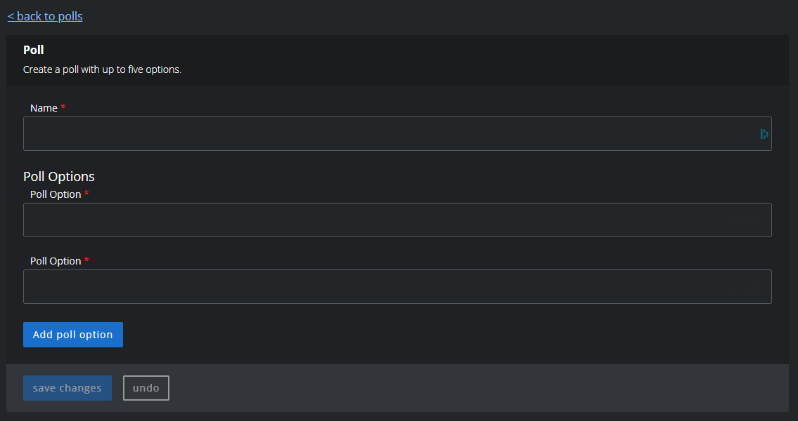
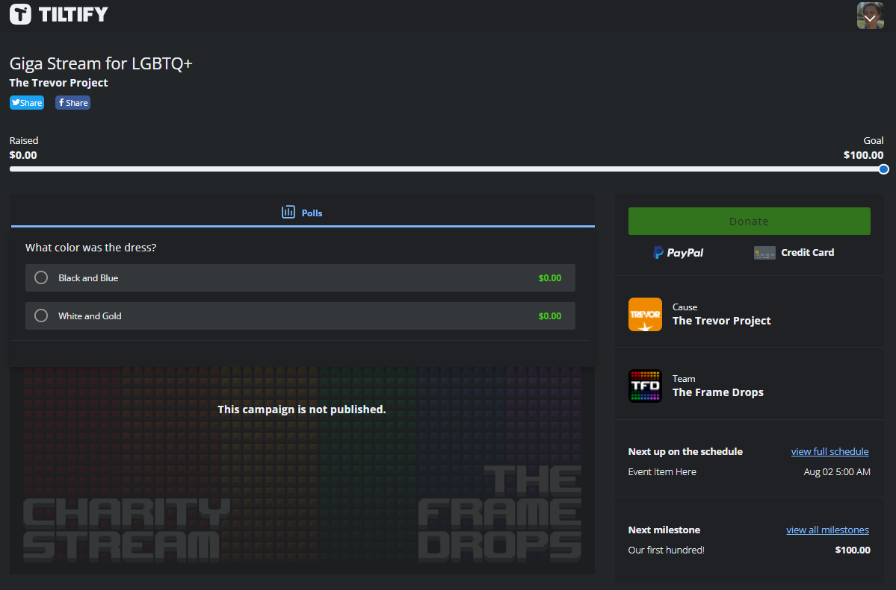

# Campaign Polls

A [poll](https://info.tiltify.com/support/solutions/articles/43000011861-adding-incentives-polls) can be added to the campaign as a way for viewers to vote on a decision. Each choice is weighted by the amount raised for each option in the poll.

## Adding a Poll

Each poll has the following options:
- a short name (which should contain the poll question)
- a list of up to 5 options to vote for

To ask for a poll to be added to the campaign, send a message to [the `#streamers` channel in Discord](https://discord.theframedrops.com) with the above information.

## Appearance

Each active poll is listed in the donation page and can be selected by the user.

